# Cucumber使用进阶

### Cucumber是什么
Cucumber是BDD模式下实现可执行规范（Executable Specifications)的开源工具，但是它的使命并不局限于做自动化验收测试，更加重要的在于其能够在团队成员之间构建统一的交流基础（feature文件）、规范交流用语（Domain Specific Language）、提高各个利益相关方（Business Stakeholders）沟通效率和效果从而达到提升产品质量、做成客户期望得到的产品这一最终目标。


### 如何使用Cucumber
Cucumber有很多种语言的实现版本，例如Java、Ruby、.NET、JavaScript等等，并且Cucumber可以和主流的测试框架很好地集成，常见的Selenium、SpringFramework、Ruby on Rails等，能够方便地引入到你的测试工作中去，几乎没有任何门槛。以一个Java测试项目为例，介绍如何使用Cucumber的Java语言实现版本：Cucumber-JVM。

#### 将Cucumber-JVM依赖加入到项目中
如果你的项目是使用Maven管理所依赖的第三方依赖jar包，那么引入Cucumber-JVM将是一件优雅而且轻松的事情，只需要简单的将如下的Code Snippet加入到项目的pom.xml的“<dependencies>”下即可：
``` xml
	<dependency>
		<groupId>info.cukes</groupId>
		<artifactId>cucumber-java</artifactId>
		<version>${cucumber.version}</version>
		<scope>test</scope>
	</dependency>
	<dependency>
    	<groupId>info.cukes</groupId>
        <artifactId>cucumber-junit</artifactId>
        <version>${cucumber.version}</version>
		<scope>test</scope>
	</dependency>
	<dependency>
		<groupId>junit</groupId>
		<artifactId>junit</artifactId>
		<version>${junit.version}</version>
		<scope>test</scope>
	</dependency>
```
*关于version，请尽量选择适合自己项目的，如果你使用的是Java 7，如果没有特殊的要求可以与本文一样采用`<cucumber.version>1.2.2</cucumber.version>`*

#### 编写 Executable Specification
Cucumber之所以受到如此的推崇，与其Executable Specification这个特性不无关系。顾名思义，可执行规范给出了至少两个方面的意义：
- 可执行性（Executable）：你可以像执行代码（Java、Ruby...)一样运行这些规范，来验证、验收目标应用。当然，这一点是从技术人员的视角来看的；
- 规范性（Specification）：从非技术人员的视角触发，相比验证本身，他们更加关心系统功能的清晰描述：系统在什么场景下能够做什么样的事情。

这看似简单的两方面似乎关联并不是很大，但是如何能够在同一个基础（feature files）之上做到两者的融合，却是Cucumber最大的妙处。*从项目管理人员的角度来看，Cucumber是技术人员和非技术人员交流的桥梁，从更加深的层面来看，Cucumber能够使增加各个利益相关方的沟通，因为只有深入的沟通，在各方都理解了真正期望的功能这一基础之上，才能产出都认可的Executable Specification！*

回归到工具这一层面，Cucumber是以feature文件来组织测试的，相信大家都很清楚这里之所以采用feature这个后缀，其实正是为了凸显用户在使用系统中所能够享受到的服务和功能。以ATM取钱场景为例子，通过如下的大致步骤：创建feature文件，生成测试Step Definitions，运行测试用例来具体说明如何在测试工作中使用Cucumber。

##### 创建Feature文件
自动柜员机（ATM）大家都非常熟悉，现在假设你在为某一个银行所提供的固定金额取款功能编写测试用例，经过跟利益相关方讨论之后，针对这一功能，你们得出了如下的场景定义，此处以Feature文件的形式写出来：
`src/main/resources/features/FixedAmountWithdraw.feature`
 ``` gherkin
# language: zh-CN
功能: 使用ATM固定金额方式取款
  通常“取款”菜单包含了几个固定金额，使用这些固定金额取款可以避免从键盘输入提取金额，从而可以加速交易，提高取款的效率。

  场景大纲: 固定金额取款
    假如 我的账户中有余额"<accountBalance>"元
    当 我选择固定金额取款方式取出"<withdrawAmount>"元
    那么 我应该收到现金"<receivedAmount>"元
    而且 我账户的余额应该是"<remainingBalance>"元
    例子:
      | accountBalance | withdrawAmount | receivedAmount | remainingBalance |
      | 1000.00        | 100.00         | 100.00         | 900.00           |
      | 500.00         | 500.00         | 500.00         | 0.00             |
 ```

上述文件中，需要说明的是：
 - 1，`# language: zh-CN`表明feature文件中所使用的描述语言是中文简体，Cucumber本身支持超过30种语言（此处语言是Spoken Language而非Programming Language）
  - 通过`java cucumber.api.cli.Main --i18n help`查看所支持的所有Spoken Language；
  - 通过`java cucumber.api.cli.Main --i18n LANG`查看所给定语言支持的所有关键字，比如查看中文简体（zh-CN）支持的所有Gherkin关键字，可以通过执行命令`java cucumber.api.cli.Main --i18n zh-CN`查看，其输出类似如下内容：
``` gherkin
      | feature          | "功能"                   |
      | background       | "背景"                   |
      | scenario         | "场景", "剧本"             |
      | scenario_outline | "场景大纲", "剧本大纲"         |
      | examples         | "例子"                   |
      | given            | "* ", "假如", "假设", "假定" |
      | when             | "* ", "当"              |
      | then             | "* ", "那么"             |
      | and              | "* ", "而且", "并且", "同时" |
      | but              | "* ", "但是"             |
      | given (code)     | "假如", "假设", "假定"       |
      | when (code)      | "当"                    |
      | then (code)      | "那么"                   |
      | and (code)       | "而且", "并且", "同时"       |
      | but (code)       | "但是"                   |
```
 - 2，采用中文描述feature文件，首先得益于Cucumber本身的支持，但是另外一个最重要的原因是我期望所描述的功能可以被利益相关方清楚地读懂，使用利益相关方的Spoken Language来撰写规范可以使沟通更加方便，是Cucumber的有一大利器；
 - 3，如果不使用``这个header，默认情况下，Cucumber会以英语解析feature文件寻找场景和Steps，此时，Gherkin的关键词必须使用英文：
 ``` gherkin
Feature: 使用ATM固定金额方式取款
  通常“取款”菜单包含了几个固定金额，使用这些固定金额取款可以避免从键盘输入提取金额，从而可以加速交易，提高取款的效率。

  Scenario Outline: 固定金额取款
    Given 我的账户中有余额"<accountBalance>"元
    When 我选择固定金额取款方式取出"<withdrawAmount>"元
    Then 我应该收到现金"<receivedAmount>"元
    And 我账户的余额应该是"<remainingBalance>"元
    Examples:
      | accountBalance | withdrawAmount | receivedAmount | remainingBalance |
      | 1000.00        | 100.00         | 100.00         | 900.00           |
      | 500.00         | 500.00         | 500.00         | 0.00             |
 ```
 - 4，使用Cucumber dry run命令`java cucumber.api.cli.Main -d src/main/resources/features/FixedAmountWithdraw.feature`可以验证对应的feature文件内容是否有格式错误，同时，这个命令也会打印出dummy的steps definitions，参考如下的输出内容：
  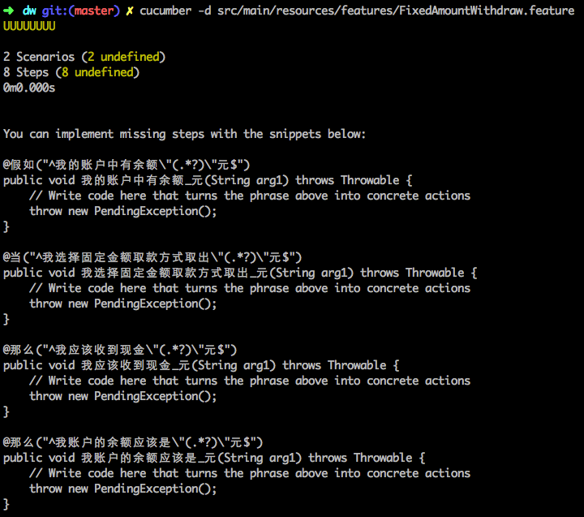

##### 生成Step definitions
当然，通过上述的dry run产生的dummy steps definitions可以作为创建对应Step definitions的Skeleton，在没有IDE协助你生成Step definitions的前提下，我推荐大家使用dry run的输出作为基础，创建自己的Step definitions。此处，本文推荐大家使用集成开发环境所提供的Step definitions工具来实现上述操作，其原因是：
- 1，集成开发工具能够生成较为完善的代码，不仅仅是steps definitions本身，而且包含了对应的Java Class类；
- 2，对于刚接触Cucumber不久且充满好奇心的使用者而言，能够接触到Cucumber的实现代码，更加有利于了解其运行原理，而集成开发环境在这一点上能够提供很大的帮助。

由于Eclipse暂时并不支持Steps definitions的生成操作，下面本文以JetBrain的优秀Java IDE环境Intellij IDEA述如何实现从feature生成Steps definitions。

###### 在Intellij IDEA下生成Steps definitions
在编写feature文件的过程中，IDEA会提示目前文件中哪些步骤（steps）是没有对应的Java step definitions，如下图所示，Intellij IDEA会以黄色的小灯泡这个提示标志来提醒作者：
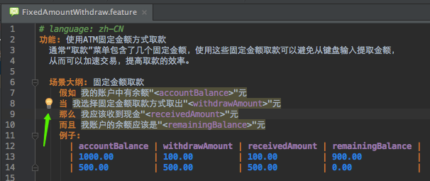
作者只需要按照如下的步骤来生成对应的Steps definitions即可：
- 1，点击该提示图标，并从弹出的菜单项中选择“Create Step Definition”或者“Create All Steps Definition”；
- 2，在弹出的“Create New Step Definition File”模式窗口中填写文件名称、实现语言以及文件位置等信息即可；
- 3，重复步骤1和2直到所有的step都生成对应的Java step definition即可。
 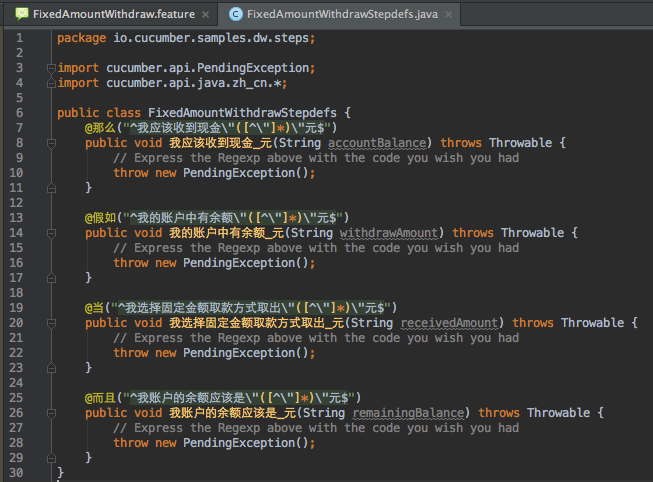
 ``` java
    package io.cucumber.samples.dw.steps;

    import cucumber.api.PendingException;
    import cucumber.api.java.zh_cn.*;

    public class FixedAmountWithdrawStepdefs {
        @那么("^我应该收到现金\"([^\"]*)\"元$")
        public void 我应该收到现金_元(String accountBalance) throws Throwable {
            // Express the Regexp above with the code you wish you had
            throw new PendingException();
        }

        @假如("^我的账户中有余额\"([^\"]*)\"元$")
        public void 我的账户中有余额_元(String withdrawAmount) throws Throwable {
            // Express the Regexp above with the code you wish you had
            throw new PendingException();
        }

        @当("^我选择固定金额取款方式取出\"([^\"]*)\"元$")
        public void 我选择固定金额取款方式取出_元(String receivedAmount) throws Throwable {
            // Express the Regexp above with the code you wish you had
            throw new PendingException();
        }

        @而且("^我账户的余额应该是\"([^\"]*)\"元$")
        public void 我账户的余额应该是_元(String remainingBalance) throws Throwable {
            // Express the Regexp above with the code you wish you had
            throw new PendingException();
        }
    }
 ```

###### 在Eclipse下生成Steps definitions
在Eclipse中，仍然可以通过Dry run的方式来实现部分steps definitions code的生成，这一点请参考前文中Cucumber dry run命令。

##### 在IDEA中调试运行测试用例
Cucumber测试用例有两种方式可以启动，debug mode下，两种方式都可以对Steps definitions代码进行debug：
- 1，Run with JUnit方式；
 这种方式要求必须有JUnit Test来触发，常规的做法是：
  - a，创建一个空白的JUnit Test：所谓空白就是在JUnit Test类中没有任何方法；
  - b，按照Cucumber所提供的Options annotation来引入所需要使用的feature文件和Steps definitions类；
  - c，按照需要设置报告格式等，下面是以JUnit方式触发FixedAmountWithdraw.feature文件的配置Sample；
  ``` gherkin
    package io.cucumber.samples.dw;

    import cucumber.api.CucumberOptions;
    import cucumber.api.junit.Cucumber;
    import org.junit.runner.RunWith;

    @RunWith(Cucumber.class)
    @CucumberOptions(
            format = {"json:target/json-report/dw.json"}
            , features = {"classpath:features/FixedAmountWithdraw.feature"}
            , glue = {"io.cucumber.samples.dw.steps"}
    )
    public class AppTest {
    }
  ```
  - d，然后就可以以JUnit用例的方式运行或者调试测试用例的实现了，此处不再赘述。
 *Eclipse和Intellij IDEA都支持这样的调试方式*
- 2，IDEA下直接运行Scenario/Scenario Outline
 - a，IDEA下可以直接选中所需要运行或者调试的Scenario/Scenario Outline；
 - b，然后右键打开弹出菜单选择“Run”或者“Debug”；
 - c，并选择对应的Scenario名称即可运行或者调试该场景对应的Steps definitions。
	 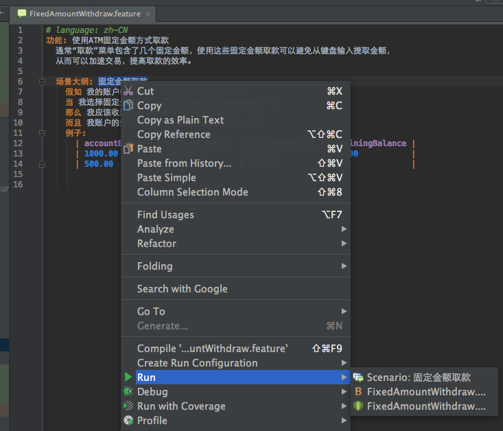


##### 定制化运行Cucumber测试用例
Cucumber是以feature文件来组织测试用例的，关于如何customized运行Cucumber测试用例，首先需要向大家介绍就是如何组织feature文件。Feature文件通常是按照子文件夹来组织的，你可以按照功能归属、类别、Sprint Plan等等来做，至于哪一种是最好的，通常需要并没有准确的答案，一个可行的建议是先按照你认为最可行的方式组织起来，尝试一段时间，持续一两个iteration，后续如果没有发现明显的问题就可以坚持下来。通常你需要尝试几次才能确定哪一种方式最适合自己的team。子文件夹就像是一本书的目录对应的章节，便于索引。

Cucumber还支持为Scenario指定标签（tag），tag是以“@”字符开头的一个单词，用来表述被修饰对象（可以是feature，可以是scenario，可以是scenario outline甚至可以是scenario outline下的examples）所属的类别。Tag可以是一个，也可以是多个，Cucumber本身并不限制tag的个数。
``` gherkin
# language: zh-CN
@withdraw
功能: 使用ATM固定金额方式取款
  通常“取款”菜单包含了几个固定金额，使用这些固定金额取款可以避免从键盘输入提取金额，
  从而可以加速交易，提高取款的效率。

  @fixedAmount
  场景大纲: 固定金额取款
    假如 我的账户中有余额"<accountBalance>"元
    当 我选择固定金额取款方式取出"<withdrawAmount>"元
    那么 我应该收到现金"<receivedAmount>"元
    而且 我账户的余额应该是"<remainingBalance>"元
  @positive
    例子:
      | accountBalance | withdrawAmount | receivedAmount | remainingBalance |
      | 1000.00        | 100.00         | 100.00         | 900.00           |
      | 500.00         | 500.00         | 500.00         | 0.00             |
  @negative
    例子:
      | accountBalance | withdrawAmount | receivedAmount | remainingBalance |
      | 1000.00        | 1100.00        | 0.00           | 1000.00          |
      | 500.00         | 600.00         | 0.00           | 500.00           |
```

|Tag修饰对象|表述的意义|
|-|-|-|
|Feature|该Feature文件中的所有Scenario和Scenario Outline都会继承修饰在Feature的tag，比如上例中的@withdraw|
|Scenario / Scenario Outline|表示tag适用于Scenario/Scenario Outline，Scenario Outline下的Examples会继承定义在其上的tag，比如上例中的@fixedAmount|
|Examples|只对Scenario Outline及当前的Examples有效，比如上例中的@positive和@negative|

如果说子文件夹是目录对应的章节，那么tag可以看做是添加到书中的便签，让你迅速找到对应的scenario。Tag可以看做是另外一种维度的索引，可以为Cucumber测试用例集合添加不同的维度，从而便于检索和过滤，这一点在选择性地运行Cucumber测试用例时显得尤其重要！

###### 按照tag expression过滤测试用例

纯粹的将expression本身会让读者觉得味同嚼蜡，下面本文以不同的例子为基础，讲述如何适用基础的tag expressions来过滤Cucumber测试用例们。
- 运行指定的单个tag对应的测试用例
 命令：`java cucumber.api.cli.Main --tag @focus features`只会运行features中那些被标记为“@focus”tag的场景。仅仅关注某一些或者某一个场景其实在场景调试过程中非常有用，尤其是在你没有可用的IDE环境中，比如在没有Window环境的Unix/Linux机器上调试测试用例时；

- 运行@focus或者@key对应的测试用例
 命令：`java cucumber.api.cli.Main --tag @focus,@key features`可以运行features中那些被标记为“@focus”和被标记为“@key”的场景。此处的逗号可以被理解为逻辑上的“OR”关系运算符，因此运行的结果是二者或者多个tags的并集。

- 运行被@fast标记并且@bvt标记的测试用例
 命令：`java cucumber.api.cli.Main --tag @fast --tags @bvt features`可以运行features中那些既被@fast标记又@bvt标记的测试用例。命令可以从字面上理解为运行BVT测试用例中那些运行速度快的测试用例，假设你在做code refactor，想快速验证一下所做的改动是否影响到主流程，上述命令会帮你快速运行BVT相关的用例，当然，前提是你已经对测试用例们做了tag。

- 不运行被@slow标记但是被@bvt标记的测试用例
 命令：`java cucumber.api.cli.Main --tag ~@slow --tags @bvt features`可以运行features中那些被标记为bvt但是不被tag @slow修饰标记的测试用例。理想情况下，我们期望测试用例运行的足够快，但是现实测试中，通常需要对系统进行登录认证，授权，不乏有运行慢的用例，因此，标记出那些运行速度慢的用例，然后只在适合的时间运行它们，这对于提高测试用例的执行效率也是非常有必要的。此处的“~”表示否定的意思。

如果你担心用例中有同样的标记比如@focus也在被别人使用，不希望通过tag的方式来标记测试用例，Cucumber支持以别的方式来实现同样的功能：Filter on lines 和 Filter on names

###### 按照行号过滤测试用例
 命令：`java cucumber.api.cli.Main src/main/resources/features/FixedAmountWithdraw.feature:12:17`可以运行FixedAmountWithdraw.feature文件中的第12和17行，如果需要运行更多的行，只需要在feature文件名之后加上“:行号”

###### 按照场景名称过滤测试用例
 命令：`java cucumber.api.cli.Main --name 固定金额取款 features`可以运行名称为“固定金额取款”的Scenario或者Scenario Outline。对于debug单个场景时，这个功能非常有用。

###### 指定Cucumber运行结果报告
Cucumber本身支持多种报告格式以适用于不同环境下调用的报告输出：
 - pretty ：用于在命令行环境下执行Cucumber测试用例所产生的报告，如果你的console支持，pretty形式的报告还可以按照颜色显示不同的运行结果；如下图所示的例子分别显示了用例执行通过和用例没有Steps definitions的输出报告：
  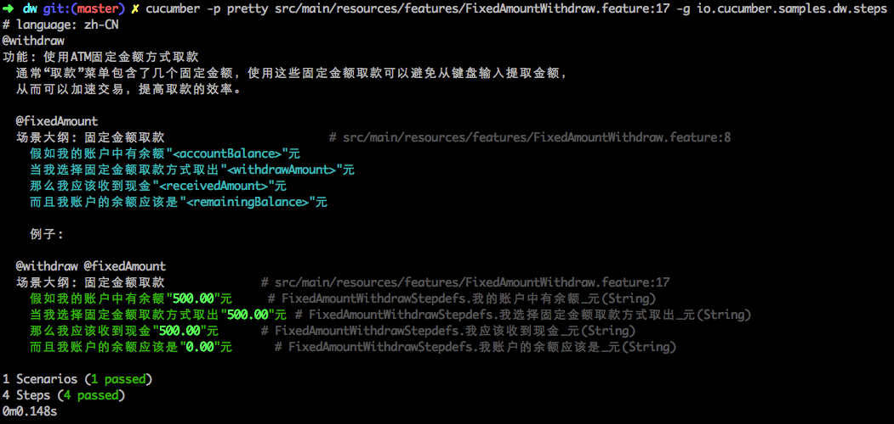
  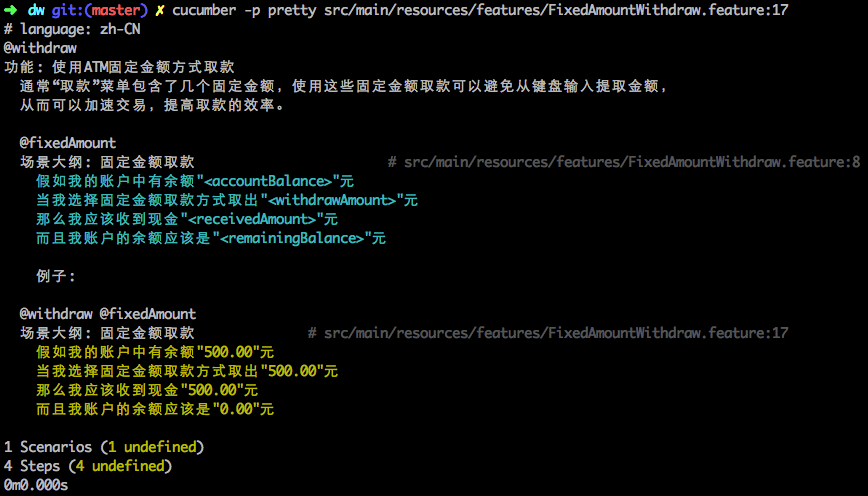

 - json ：多用于在持续集成环境下的夸机器生成报告时使用，比如在用例执行的机器A上运行Cucumber测试用例，而在调度或报告机器B上生成用例执行报告，此时只需要把生成的json报告传输到机器B上即可。
  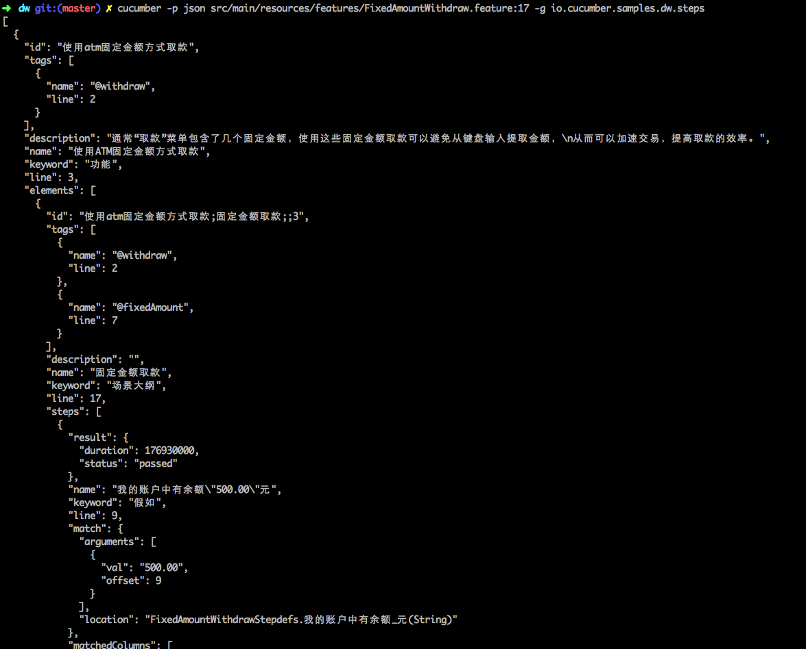

 - html ：用于生成简单的HTML格式的报告以便查看Cucumber测试用例运行的结果
  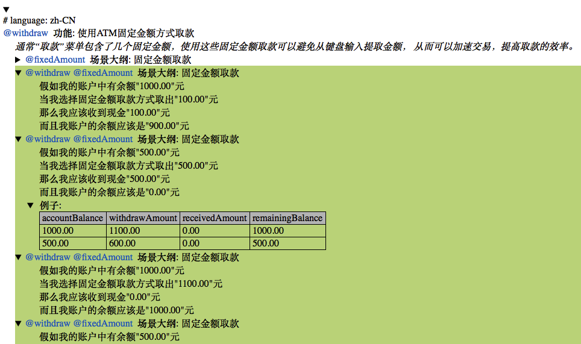

 - junit ：用于生成JUnit格式的报告
  ``` xml
    <?xml version="1.0" encoding="UTF-8" standalone="no"?>
    <testsuite failures="0" name="cucumber.runtime.formatter.JUnitFormatter" skipped="0" tests="1" time="0.177755">
        <testcase classname="使用ATM固定金额方式取款" name="固定金额取款" time="0.177755">
            <system-out>
            <![CDATA[
                假如我的账户中有余额"500.00"元.........................................................passed
                当我选择固定金额取款方式取出"500.00"元.....................................................passed
                那么我应该收到现金"500.00"元..........................................................passed
                而且我账户的余额应该是"0.00"元..........................................................passed
            ]]>
            </system-out>
        </testcase>
    </testsuite>
  ```

### 如何避免Cucumber测试用例报告失真

从上面描述的Cucumber支持的报告格式和样例，看不出有什么失真啊？错了就错了，对了就对了，很明确的啊！为什么测试报告会失真？

这里说的测试报告失真是以Maven调用的方式运行Cucumber测试用例时才会出现，但是这种运行方式是大家在持续集成环境中经常会用到的，因此，此处才对这种情况加以处理，以避免在持续集成环境下出现测试报告失真。
一般情况下我们在Maven中执行测试用例只需要运行命令`mvn test`即可，下面是一次运行中给出的结果：
  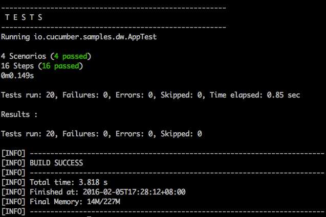
从中可以看出：
- Cucumber提示运行了4个Scenario一共16个Step且全部通过了；
- 可以理解成一共执行了4个JUnit测试用例，没有失败或编译错误；
- 但是Maven给出的报告却提示运行了20个Test，全部通过。

这就造成了运行报告的失真：

- 1，事实上没有那么多测试用例，但是Maven却给出了数倍于真实的测试用例；
- 2，如果有一个失败，其失败率明显会低于真实情况；
- 3，如果以此为依据来refactor代码，很可能造成过于自信而导致后续工作量无法承受。

鉴于此，必须要避免这样的情况，有什么样的方法可以避免吗？

当然有，不知读者是否还记得Cucumber report支持json呢？Github上有很多开源的插件或者Cucumber扩展可以帮助从JSON格式的报告生成HTML格式的报告。本文中推荐大家使用[Cucumber-reporting](https://github.com/damianszczepanik/cucumber-reporting)。[Cucumber-reporting](https://github.com/damianszczepanik/cucumber-reporting)不仅能够完成从JSON格式报告生成HTML格式报告，而且可以按照tag和feature以及step查看，不得不提的是生成的HTML格式报告的样式非常好看，下面就是以本文中所使用的feature文件为例，以[Cucumber-reporting](https://github.com/damianszczepanik/cucumber-reporting)来生成的HTML报告：
 - 按照Features方式查看
  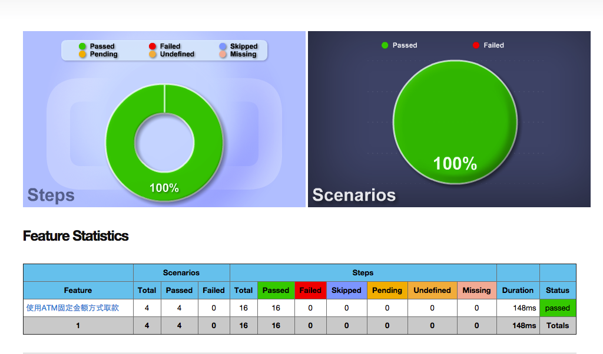
 - 按照Tags方式查看
  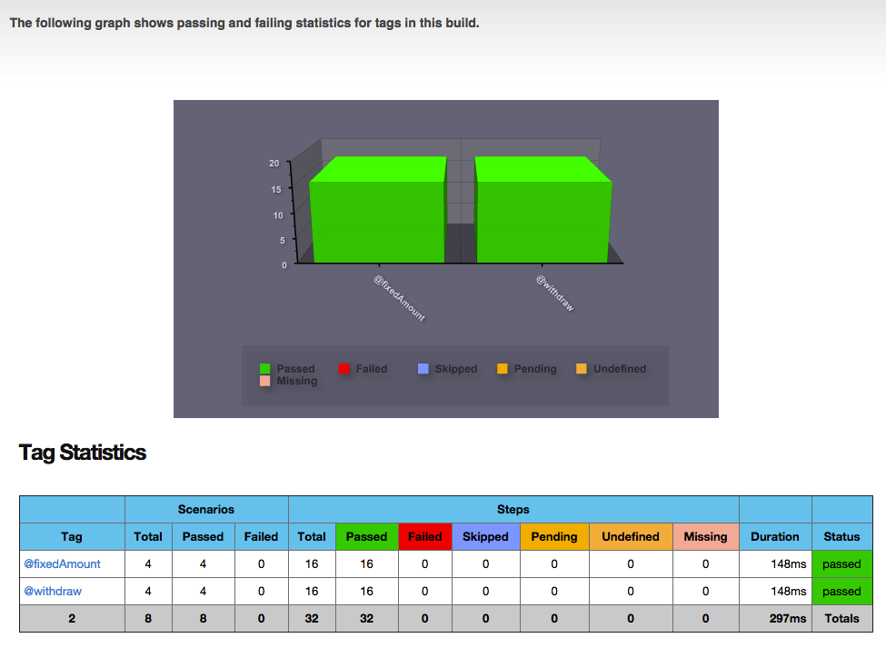
 - 按照Steps方式查看
  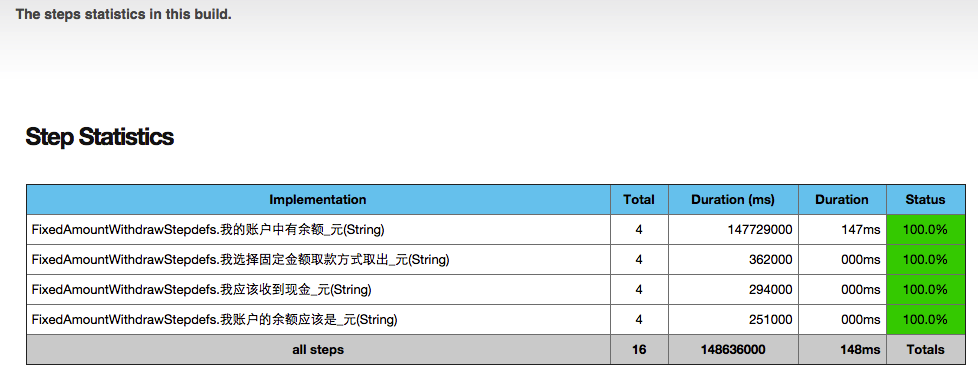

从上述报告中可以看出，Scenario和Step是分别统计的，因此只需要关注Scenario失败的的信息就能够避免报告失真。


